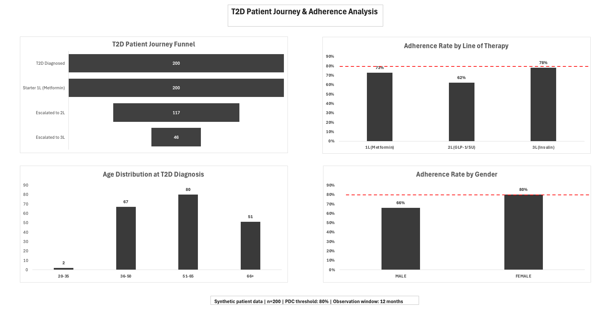

# T2D Patient Journey & Adherence Analysis

## Overview
An end-to-end patient analytics project simulating how pharma analytics teams track Type 2 Diabetes (T2D) patients across therapy lines and measure medication adherence using industry-standard metrics.

## Business Questions Answered
- How do T2D patients progress through lines of therapy (1L → 2L → 3L)?
- What proportion of patients meet the PDC ≥ 0.80 adherence threshold?
- Does adherence vary by line of therapy or patient demographics?

## Dataset
Synthetic patient data (n=200) generated to simulate real-world T2D patient journeys including diagnosis, therapy initiation, escalation, and adherence patterns.

## Methodology
- **Cohort Definition:** 200 T2D patients tracked from diagnosis through therapy escalation
- **Line of Therapy (LoT):** Sequenced medications into 1L (Metformin), 2L (GLP-1/Sulfonylurea), 3L (Insulin)
- **PDC Calculation:** Proportion of Days Covered over 12-month observation window; adherence threshold PDC ≥ 0.80 (HEDIS-aligned)

## Key Findings
- 58.5% of patients escalated from 1L to 2L therapy
- 23% of patients reached Insulin (3L) — highest disease severity segment
- Adherence below 80% threshold across all lines: 1L (73%), 2L (62%), 3L (78%)
- Female patients showed significantly higher adherence (80%) vs male patients (66%)
- 2L therapy showed the lowest adherence — suggesting therapy complexity is a key barrier

## Dashboard
Built in Microsoft Excel using Power Query for data transformation, COUNTIFS/VLOOKUP for metric calculation, and native Excel charts for visualization.

## Tools
- Microsoft Excel (Power Query, Pivot Tables, Advanced Formulas)
- Data: Synthetic patient dataset

## Pharma Domain Concepts Applied
- Line of Therapy (LoT) sequencing
- Proportion of Days Covered (PDC) — HEDIS-aligned threshold
- Patient funnel analysis
- Adherence segmentation by demographics and therapy line
